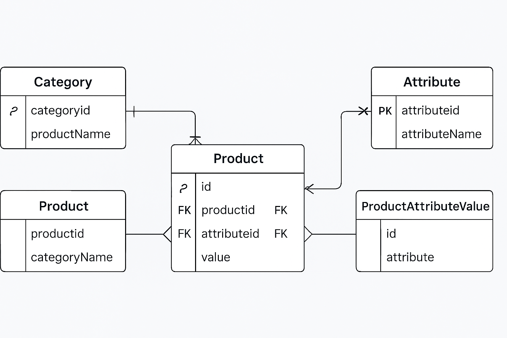

# Internal Product Tool

A lightweight internal tool to manage product categories, custom attributes per category, and products with dynamic attribute values.

## Step 1 – Database Design

### ERD

**Justification**
- **Normalization (3NF):** Categories, Attributes, Products, and ProductAttributeValues are separated to remove redundancy.
- **Dynamic & flexible:** Each category defines its own attributes without schema change.
- **Scalable:** Product–Attribute values modeled as a junction table.
- **Data integrity:** Foreign keys and data type enforcement ensure valid data.
- **Future-proof:** Adding new categories or attribute types requires no migrations.


## Step 2 – Class Design

### Class Diagram

**Justification**
- `Category` owns `attributes` and `products`.
- `Attribute` defines metadata like type and is reused within a category.
- `Product` stores core fields and holds `ProductAttributeValue` records.
- `ProductAttributeValue` links a product with an attribute.
- Validation is centralized in `validate_value()`.


## Step 3 – Implementation

Implemented with **Flask, SQLAlchemy, Jinja2, SQLite**.

### Features
- **Categories** – Create/list categories, manage attributes
- **Attributes** – Add per-category attributes with types (text, number, boolean, date)
- **Products** – Create products, edit attribute values with validation
- **Dashboard** – KPIs and latest products
- **Seed** – `/seed` route for demo data

### Run locally
```bash
python -m venv 'PATH/TO/VENV' # create virtual env

source venv/bin/activate # activate virtual env

pip install flask flask_sqlalchemy

python app.py
```


# Product Catalog System

This document combines the **ER Diagram** and **Class Diagram** for the Product Catalog System.


## 1. ER Diagram

The ER (Entity-Relationship) diagram defines the database schema for managing **categories, products, attributes, and their values**.

### ER Diagram: (click to view) - 


### Explanation:
- **Category**: Represents the product category (e.g., Electronics, Clothing).
- **Product**: Belongs to a category and has associated attributes.
- **Attribute**: Defines product characteristics (e.g., color, size).
- **ProductAttributeValue**: Stores the actual value of attributes for each product.


## 2. Class Diagram: (click to view) - 

The Class Diagram explains the **object-oriented structure** of the system.

### Class Diagram:


### Explanation:
- **Category Class**: Contains category details and methods to add/remove attributes.
- **Product Class**: Represents a product, linked to a category, and holds attribute values.
- **Attribute Class**: Defines attributes and includes validation for attribute values.
- **ProductAttributeValue Class**: Links a product to its attribute values with methods to set/get values.

---

## 3. Summary

- **ER Diagram** → Focuses on the database schema and relationships.
- **Class Diagram** → Focuses on the system design and behavior in an object-oriented manner.

---

